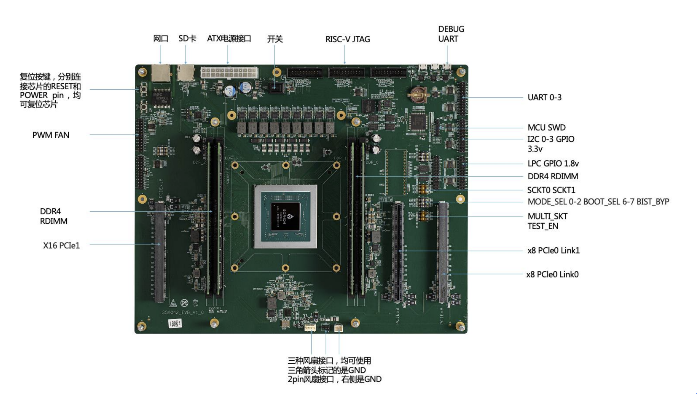
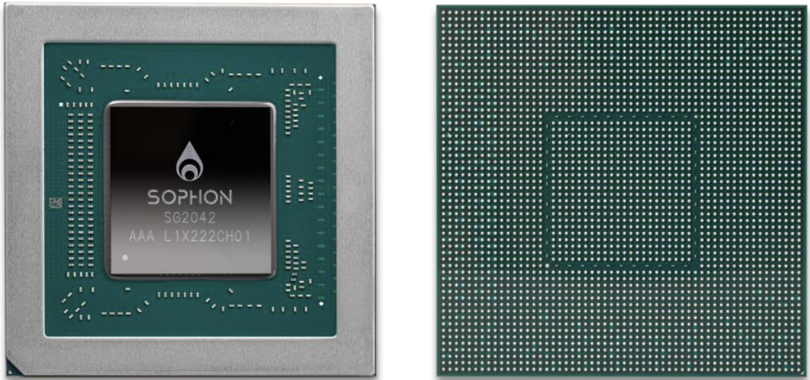
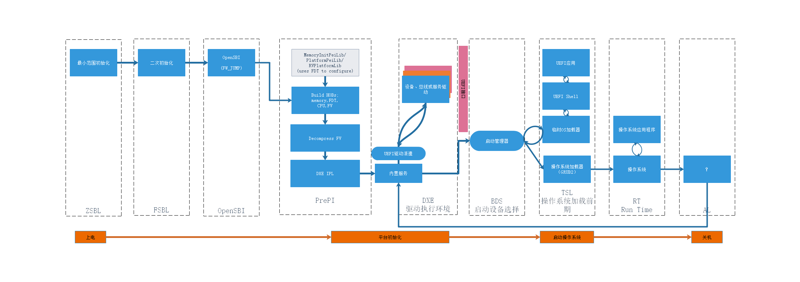

# Sophogo SG2042 EDK2 RISC-V Platform Project
## Sophgo SG2042 Platform
The development work for this project was carried out around the Sophgo SG2042 EVB development board.
The deployment of EDK2 was completed on the EVB test version. Below is the external appearance display of the EVB version.

SG2042 is a server processor based on the RISC-V architecture.It has 64 RISC-V cores and supports up to 2-way SG2042 interconnectivity.
Each SG2042 CPU can be configured with a maximum of 4 DIMM memory slots (RDIMM & UDIMM), supporting a maximum memory capacity of 256GB. It also supports a maximum of 32 PCIe 4.0 channels.

## SG2042 EDK2 RISC-V Design and the Boot Processes
The SG2042 RISC-V EDK2 project is developed based on the original Sophgo SG2042 project.SG2042 RISC-V edk2 is designed and optimized based on the edk2 startup phase. The startup process can be roughly divided into the following stages:**ZSBL+FSBL+OpenSBI+EDK2+GRUB2+OS**.The design diagram and start-up process are shown in the figure below.

**SG2042 RISC-V EDK2 startup flowchart**

**ZSBL Phase**

ZSBL is the first stage of chip initialization, Code provided by Sophgo.the main work is to initialize DDR.

**FSBL Phase**

**Note:** The FSBL here corresponds to the ZSBL stage code provided by Sophgo.
The ZSBL stage works for the following:
1. Initialize the serial port of the ZSBL stage for DEBUG.
2. Establish a memory mapping table for initializing and configuring the memory management of the operating system or firmware.
3. Initialization of some CPU functions.

**OpenSBI Phase**

OpenSBI provides the conditions for platform initialization of SG2042, which runs as an independent firmware and an environment of an initialization link before edk2, which exists in the form of FW_PAYLOAD, which initializes the system in M-mode and initializes some functions of SG2042 , and put the subsequent edk2 operating environment in S-mode.

**PrePI Phase**

The PrePI phase builds some HOBs on Memory, CPU, FV, Stack and processor smbios information, eventually loading the DXE Core and transferring control.

**DXE Phase**

edk2 DXE OpenSBI protocol provides the unified interface for all DXE drivers to invoke SBI services，the DXE stage mainly adds the SG2042 SD card reading driver to read the contents of the SD card.

**BDS Phase**

The BDS stage runs under S-mode,The implementation of the RISC-V edk2 port in the BDS stage is executed with the PcdDxeCorePrivilegeMode PCD configuration permission, because OpenSBI converts the mode to S-mode, when BDS hands over the power to the operating system, it must be S-mode, avoiding another mode switch.

**TSL Phase**

The work at this stage is mainly to use edk2 Shell to boot and start the GRUB2 program code in the SD card, and use GRUB to load different OS operating systems in the partition.

**RT Phase**

No work done.

**AL Phase**

No work done.
